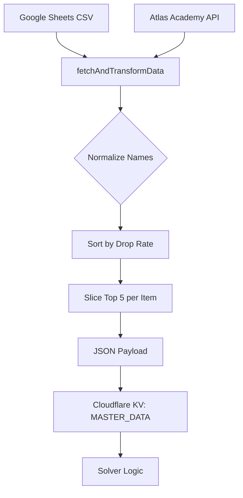

# Design: Master Data Update Logic and Solver Optimization

## Data Flow

## Implementation Details

### 1. Name Normalization
A hybrid strategy to map community-driven abbreviations to official Atlas Academy IDs:
- **Static Map**: Handles irregular names (e.g., `証` -> `英雄の証`).
- **Dynamic Class Mapping**: Matches patterns like `[Class][Type]` (e.g., `剣秘` -> `セイバーの秘石`).
- **Substring Matching**: Fallback for partial matches.

### 2. Top 5 Filtering
To optimize the `javascript-lp-solver` performance and stay within KV limits:
- For each item, sort all associated quests by `drop_rate` descending.
- Take only the first 5 records.
- Prune the final quest list to only include those referenced by at least one top-5 item entry.

### 3. Testing Strategy
- **Framework**: Vitest.
- **Mocking**: Mock the global `fetch` to simulate both the Atlas Academy JSON response and the Google Sheets CSV output.
- **Verification**: Assert correct item counts, quest pruning, and exact drop rate calculations.

### 4. Continuous Integration
- Integrated `husky` and `lint-staged` with `next lint --fix --file` to ensure code quality before each commit.
- Added a `test` script to `package.json`.
