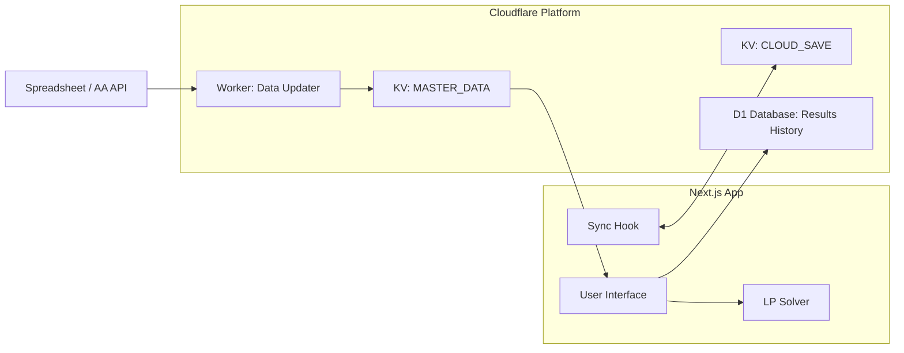

# システム概要 (System Overview)

## プロジェクトの目的
FGO（Fate/Grand Order）の素材集めにおいて、複数の素材を同時に、かつ最も効率よく（最小周回数または最小消費AP）集めるための周回計画を算出するツール。

## 全体アーキテクチャ

## 主要コンポーネント

### 1. フロントエンド (Next.js / Chakra UI)
- **UI**: 素材の必要数入力、最適解の表示、クラウド同期の管理。
- **計算エンジン**: `javascript-lp-solver` を使用したクライアントサイドでの最適化計算。
- **国際化**: `react-i18next` を使用し、日本語・英語に対応。

### 2. バックエンド (Cloudflare Workers / KV / D1)
- **マスターデータ更新**: 外部のドロップ率データを定期的に取得・加工し、KV に保存。
- **データ永続化**: 
    - ユーザー設定や所持数は KV (`CLOUD_SAVE`) に保存。
    - 周回計算の結果（履歴）は D1 データベースに保存。

### 3. 外部連携
- **FGOアイテム効率劇場**: ドロップ率データのソース。
- **Atlas Academy API**: アイテム情報のソース。
- **NextAuth.js (Google OAuth)**: ユーザー認証とデータ同期の基盤。

## 設計方針
- **クライアントサイド計算**: 高速なユーザー体験のため、ソルバーの計算はフロントエンドで行う。
- **データ最適化**: 通信量と計算負荷を抑えるため、素材ごとにドロップ率上位5件にクエストを限定する。
- **自動同期**: ユーザーが意識することなく複数デバイスでデータを共有できる体験（オートシンク）を優先。
